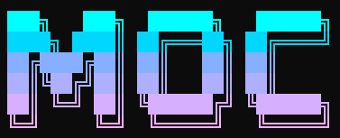

<div align="center">



**MyOwnCLI** — personal CLI hub for AWS and other services

[](https://go.dev)
[](LICENSE)
[](https://github.com/charmbracelet/bubbletea)

</div>

---

## What is `moc`?

`moc` is a single-binary, terminal-first companion for the day-to-day chores of an
engineer who lives between AWS, scripts, and shell history. Two modules ship today:

- **`sf`** — Step Functions browser, watcher, tail and rerun in a TUI.
- **`maker`** — personal command repository: save, schedule, chain CLIs you
  reach for over and over.

It runs as a one-shot command (`moc sf list`) **or** as an interactive shell
(`moc`) where each module has its own sub-shell.

## Screenshots

| Main shell | Main shell — modules |
|---|---|
|  |  |

| Maker mode | Step Functions — state machines |
|---|---|
|  |  |

| Step Functions — loading |
|---|
|  |

## Install

Requires Go 1.24+.

```bash
git clone https://github.com/renatodjunior/myownclis.git
cd myownclis
go build -o moc .
# optional — drop the binary on your PATH
mv moc ~/bin/   # or C:\Users\<you>\bin on Windows
```

## Quick start

```bash
moc                    # interactive shell
moc sf                 # Step Functions sub-shell
moc maker              # command repository TUI

moc sf list            # one-shot: list state machines
moc maker git status   # save and run "git status" under the "git" cmdlet
```

### Interactive shell

```
moc ❯ help
moc ❯ sf
moc ❯ maker
moc ❯ exit
```

### `sf` — Step Functions module

```bash
moc sf list                # list state machines
moc sf watch <name>        # follow latest executions
moc sf tail <execution>    # stream history events
moc sf rerun <execution>   # restart with same input
```

### `maker` — command repository

`maker` groups commands under **cmdlets** (e.g. `git`, `aws`, `docker`). Each
command keeps its workdir, last-run status and a tail of its log. Commands can
be run on demand, scheduled with cron, or composed into chains.

```bash
moc maker                          # open interactive TUI

# any of these save+run under the cmdlet inferred from the first word:
moc maker git status
moc maker git branch -a
moc maker "git log --oneline -20"  # paste a long command as a single string

moc maker --add "git status"       # save only, don't run
moc maker run git status           # run a previously saved command by slug
moc maker schedule git status --cron "*/15 * * * *"
```

Inside the TUI:

| Key / command | Action |
|---|---|
| `↑ ↓` | Navigate list |
| `Enter` | Open cmdlet / run command |
| `Esc` | Back / clear input |
| `/add <cmd>` | Save command in active cmdlet |
| `/del`, `/log` | Delete / show log of selected command |
| `/help` | All commands and shortcuts |
| `exit`, `q` | Leave maker |

#### Reference — every `moc maker` command

Built-in tutorial: **`moc maker examples`** prints a step-by-step walkthrough.

| Command | What it does |
|---|---|
| `moc maker` | Open the interactive TUI |
| `moc maker <command...>` | Save (cwd-bound) + run. Cmdlet = first word. |
| `moc maker --add <command...>` | Save only, do not run |
| `moc maker --workdir <dir> <command...>` | Override the captured workdir |
| `moc maker ls` | List cmdlets and chains |
| `moc maker run <cmdlet> <slug>` | Run a saved command by slug |
| `moc maker log <cmdlet> <slug>` | Tail the log (add `--all` for the full log) |
| `moc maker schedule <cmdlet> <slug> --cron "<expr>"` | Schedule (in-session) |
| `moc maker schedule ... --cron "<expr>" --os` | Also register in cron / schtasks |
| `moc maker unschedule <cmdlet> <slug> [--os]` | Remove the schedule |
| `moc maker chain add <name> <cmdlet/slug>...` | Create a chain (stops on first error) |
| `moc maker chain run <name>` | Run a chain |
| `moc maker chain export <name>` | Print chain as a portable bash script |
| `moc maker backup` | Dump everything to `~/.moc/backup/<date>.yaml` |
| `moc maker restore <file>` | Restore from a backup file |
| `moc maker examples` | Print the tutorial inline |

##### Cron — easy mode

Standard 5-field cron (`min hour dom month dow`) is fully supported. So are these
friendly aliases — they translate before being parsed, so you can mix and match:

| Easy mode | Equivalent cron |
|---|---|
| `every 5m`, `5m`, `every 5 minutes` | `*/5 * * * *` |
| `hourly`, `every hour` | `0 * * * *` |
| `every 2h`, `2h` | `0 */2 * * *` |
| `daily` | `0 0 * * *` |
| `daily at 9am`, `daily at 9` | `0 9 * * *` |
| `daily at 14:30` | `30 14 * * *` |
| `weekdays`, `weekdays at 8am` | `0 9 * * 1-5` (default 9am), `0 8 * * 1-5` |
| `weekends`, `weekends at 10am` | `0 9 * * 0,6` (default 9am), `0 10 * * 0,6` |
| `@hourly`, `@daily`, `@weekly` | robfig presets, passed through |

Examples:

```bash
moc maker schedule git status --cron "every 15m"
moc maker schedule git fetch  --cron "weekdays at 9am"
moc maker schedule kubectl get-pods --cron "*/10 * * * *"     # raw cron still works
```

## Configuration

`moc` reads a YAML config from the standard location for your OS
(`~/.config/moc/config.yaml` on Linux/macOS, `%APPDATA%\moc\config.yaml` on
Windows). All keys are optional.

```yaml
region: us-east-1
profile: default
maker:
  store: ~/.moc/maker     # where commands and logs live
```

`region` and `profile` can also be overridden per-invocation through
environment variables (`AWS_REGION`, `AWS_PROFILE`).

## Architecture

```
cmd/
├── root.go              cobra root + interactive shell
├── logo.go              shared MOC ASCII logo
├── sf.go / sf_tui.go    Step Functions module
└── maker.go             cobra subcommands for maker
    maker_tui.go         bubbletea TUI
    maker_store.go       YAML-backed command repository
    maker_exec.go        shell execution + log capture
    maker_log.go         per-command append-only log
    maker_scheduler.go   in-session cron driver
```

Built on top of:

- [`spf13/cobra`](https://github.com/spf13/cobra) + [`viper`](https://github.com/spf13/viper) — commands and config
- [`charmbracelet/bubbletea`](https://github.com/charmbracelet/bubbletea), [`bubbles`](https://github.com/charmbracelet/bubbles), [`lipgloss`](https://github.com/charmbracelet/lipgloss) — TUI
- [`aws-sdk-go-v2`](https://github.com/aws/aws-sdk-go-v2) — Step Functions
- [`robfig/cron`](https://github.com/robfig/cron) — scheduler

## Roadmap

- [ ] More AWS modules (Lambda, CloudWatch Logs, ECS)
- [ ] Maker chains UI (multi-step pipelines with conditional steps)
- [ ] Cross-machine sync of the maker store
- [ ] Plugin system for third-party cmdlets

## License

MIT — see [LICENSE](LICENSE).
